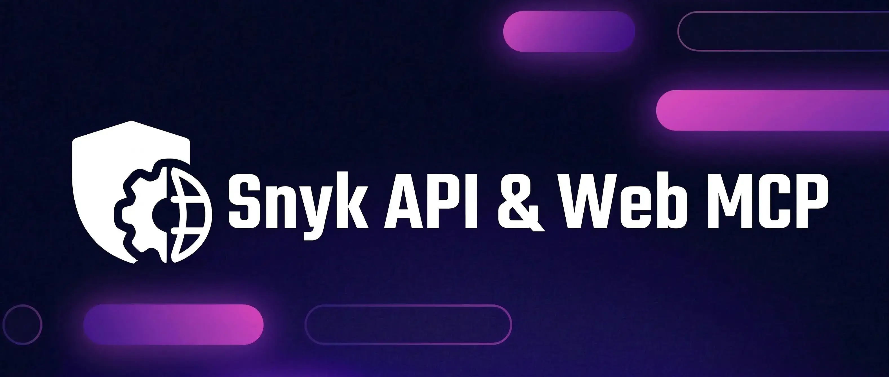

# Snyk API&Web (SAW) MCP Server

An MCP server (FastMCP 2.0) that exposes the Snyk API&Web API as MCP tools. AI assistants (Cursor, Devin, Windsurf, Claude Code, etc.) can create and configure scan targets, run scans, and manage findings through natural language.

> **Naming note:** Snyk API&Web was formerly known as Probely. The API endpoints (`api.probely.com`), web console (`plus.probely.app`), and MCP tool names (`probely_*`) still use the legacy domain and prefix. Environment variables and config sections use the new `SAW` / `saw` naming.

**Main goal:** Agentic target onboarding — create targets and automatically configure authentication (login sequences, 2FA), logout detection, and extra hosts.

See **[USER_GUIDE.md](USER_GUIDE.md)** for usage, examples, and tool reference.

## Requirements

- Python 3.10+
- Snyk API&Web API key

## Quick Start

### 1. Get Your API Key

Go to [https://plus.probely.app/api-keys](https://plus.probely.app/api-keys) and create an API key with **global (account) scope** and **admin** role.

### 2. Install

```bash
git clone https://github.com/snyk/saw-mcpserver.git
cd saw-mcpserver
python3 -m venv venv
source venv/bin/activate
pip install -e .
```

### 3. Store Your API Key

Run the setup script (prompts securely, no key in shell history):

```bash
./scripts/setup-env.sh
```

Or pipe from a secret manager: `op read 'op://vault/item/key' | ./scripts/setup-env.sh`

This writes a `.env` file in the project root (gitignored). The server loads it automatically at startup — no env var needed in your IDE config.

> **Config precedence:** environment variable → `.env` file → `config/config.yaml`

### 4. Configure Your IDE

Add to your Cursor or Claude Desktop MCP configuration (replace `/<basedir>/saw-mcpserver` with the absolute path to this repo):

```json
{
  "mcpServers": {
    "SAW": {
      "command": "/<basedir>/saw-mcpserver/venv/bin/python",
      "args": ["-m", "snyk_apiweb.server"],
      "env": {
        "PYTHONPATH": "/<basedir>/saw-mcpserver"
      }
    }
  }
}
```

The server picks up your API key from `.env` (step 3) automatically. No key in the config block needed.

**Alternatives:**
- Pass the key directly: add `"MCP_SAW_API_KEY": "your-api-key"` to the `env` block.
- Override the base URL (e.g. staging): add `"MCP_SAW_BASE_URL": "https://api.staging.probely.dev"`.
- Use a config file: set `"MCP_SAW_CONFIG_PATH": "/<basedir>/saw-mcpserver/config/config.yaml"` instead.

### 5. Start Using

Ask your AI assistant to:

- "Help me configure a new API target"
- "List the most recent findings of target X"
- "Start a scan on target X"
- "Show me the findings for target Y"

## Installation from Tarball

```bash
tar -xzvf SnykAPIWeb-*.tgz
cd SnykAPIWeb
python3 -m venv venv
source venv/bin/activate
pip install -e .
```

Then follow steps 3–4 above to store your API key and configure your IDE.

## Run the Server (standalone)

```bash
./venv/bin/python -m snyk_apiweb.server
```

## IDE Integration

### Cursor

1. Open Settings → Tools & MCP → New MCP Server
2. Paste the block below (use absolute paths)
3. Save and restart Cursor

**Option A: `.env` file (recommended)**

Run `./scripts/setup-env.sh` once, then use this config — no key in the JSON:

```json
{
  "mcpServers": {
    "SAW": {
      "command": "/<basedir>/saw-mcpserver/venv/bin/python",
      "args": ["-m", "snyk_apiweb.server"],
      "env": {
        "PYTHONPATH": "/<basedir>/saw-mcpserver"
      }
    }
  }
}
```

**Option B: Env var in config**

```json
{
  "mcpServers": {
    "SAW": {
      "command": "/<basedir>/saw-mcpserver/venv/bin/python",
      "args": ["-m", "snyk_apiweb.server"],
      "env": {
        "PYTHONPATH": "/<basedir>/saw-mcpserver",
        "MCP_SAW_API_KEY": "your-api-key"
      }
    }
  }
}
```

**Option C: Config file**

```json
{
  "mcpServers": {
    "SAW": {
      "command": "/<basedir>/saw-mcpserver/venv/bin/python",
      "args": ["-m", "snyk_apiweb.server"],
      "env": {
        "PYTHONPATH": "/<basedir>/saw-mcpserver",
        "MCP_SAW_CONFIG_PATH": "/<basedir>/saw-mcpserver/config/config.yaml"
      }
    }
  }
}
```

### Devin and Other IDEs

Use the same command and args. Set `MCP_SAW_API_KEY` or `MCP_SAW_CONFIG_PATH` as appropriate. Optionally set `MCP_SAW_BASE_URL` to override the API endpoint. Always use absolute paths.

## Skills and Rules

The server ships with **project rules** and **agent skills** that teach the AI how to use the tools. Link them so Cursor can find them:

```bash
# Project rules (per project)
mkdir -p .cursor/rules
ln /<basedir>/saw-mcpserver/config/saw_rules.mdc .cursor/rules/saw_rules.mdc

# Agent skills (global)
mkdir -p ~/.cursor/skills/saw-web-target-configuration ~/.cursor/skills/saw-api-target-configuration
ln /<basedir>/saw-mcpserver/config/skills/saw-web-target-configuration/SKILL.md ~/.cursor/skills/saw-web-target-configuration/SKILL.md
ln /<basedir>/saw-mcpserver/config/skills/saw-api-target-configuration/SKILL.md ~/.cursor/skills/saw-api-target-configuration/SKILL.md
```

## Packaging

```bash
bash scripts/package.sh
```

Creates `dist/SnykAPIWeb-<version>.tgz` (version from `snyk_apiweb/__init__.py`).
